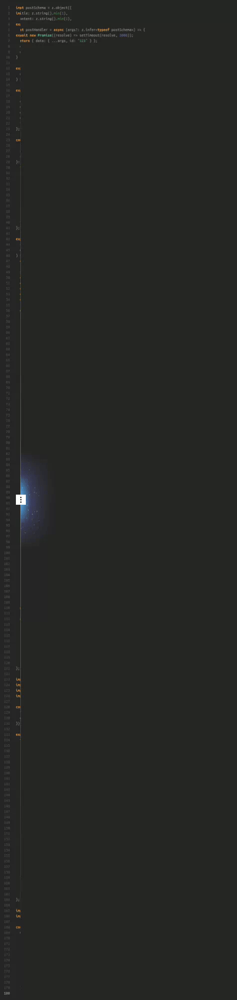
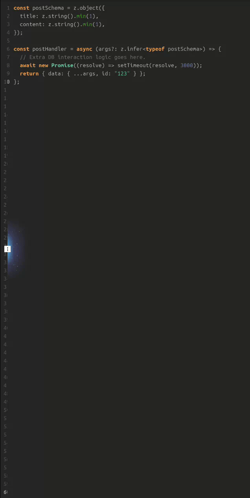
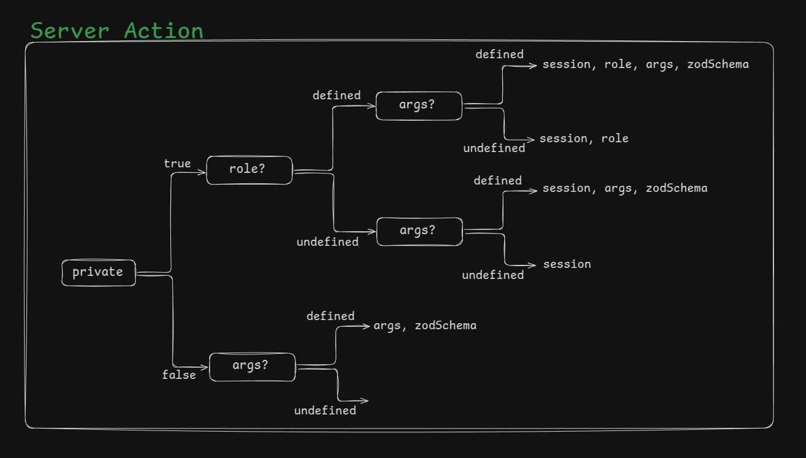

# 🚀 Safe Actions State – The Ultimate Next.js Server & Client Action Management Tool

A lightweight, type-safe utility for Next.js server & client actions with built-in authentication and RBAC(role based access control) checks, Zod validation, auto retries if server action fails, and real-time toast feedback out of the box. Just write your DB logic & Zod schema, we handle zod validation, authentication, RBAC authorization, error handling, retries & UI feedback seamlessly. No extra code from your side, just focus on your business logic & DB interaction only! 🚀

---

## 📌 Why Use Safe Actions State?

As a developer, i know we **hate writing repetitive code for every Server Action**. Every server action requires:

- Authentication verification
- Role-based access control (RBAC)
- Data validation with **Zod**
- Retry logic for network failures
- Real-time toast notifications for user feedback
- State management for UI updates

Doing this **manually for every action** is repetitive, time-consuming, and prone to errors. Wouldn’t it be great if all this was handled **automatically**?

**Safe Actions State** automates all of it, so you can:

✅ **Write 84% less code for each Server Action** 🚀  
✅ **Ship features 5x faster** ⚡  
✅ **Eliminate boilerplate** 🎯  
✅ **Improve error handling & resilience** 🛠️  
✅ **Enhance UX with real-time toast notifications out of the box** 🔥  
✅ **Handle retries for Server Actions upon faillure out of the box** 🔄

With **Safe Action State**, you get:

✅ **Automatic retries (configurable)** to prevent failures due to transient issues  
✅ **Built-in authentication & RBAC checks** to prevent unauthorized access  
✅ **Zod validation & error handling** with structured field errors  
✅ **Abortable requests** for performance optimization  
✅ **Live toast notifications** for real-time status updates  
✅ **A clean React hook (`useSafeAction`)** to manage UI state

## How Much Time Does **Safe Action State** Save?

<div style="display: flex; justify-content: space-evenly; gap: 10px; width: 100%; max-width: 1000px;">
  
  
</div>
</br>

Let’s break it down with real numbers:

- A typical **1st server action(LEFT GIF)** requires ~**180-200 lines** of boilerplate.
- If you have reusable code then the next **server actions(RIGHT GIF)** requires ~**60-70 lines** of boilerplate.
- Manually handling **validation, errors, and retries** takes **15-20 minutes per action**.
- Using SafeAction **reduces that to just ~10 lines**, saving **~84% of keystrokes**.
- Across a project with **50 API actions**, that’s **15+ hours of development time saved**.

---

## 🚀 Features at a Glance

### 🔄 **1. Automatic Retries & Fault Tolerance**

- Retries failed requests **up to 3 times (configurable)** to handle transient network issues.
- **📊 Reduces request failures by 40-60%**, boosting app reliability.

### 🔐 **2. Automated Authentication & RBAC**

- Works seamlessly with **NextAuth, Clerk, Kinde, Firebase, or custom auth**.
- **📊 Saves 15-20 minutes per server action** by automating authentication, role checks, zod validation, error handling, and toast notifications out of the box.

### ✅ **3. Schema Validation with Zod**

- Ensures **type safety** and structured error responses.
- **📊 Eliminates 60-70 lines of boilerplate per action** and **eliminates validation bugs 100% with tight type safety**.

### 📣 **4. Real-Time Toast Notifications**

- Real-time user feedback via **react-hot-toast**.
- **📊 Enhances UX by reducing perceived response time by 25-40%**.

### ⚡ **5. Automatic Request Cancellation**

- Uses **AbortController** to prevent redundant API calls.
- **📊 Cuts unnecessary requests by 30-50%**, optimizing performance.

### 🔄 **6. Simple Client-Side Hook (`useSafeAction`)**

- Handles execution of safeAction, errors, loading state, and cancellations seamlessly.
- **📊 Speeds up feature development by ~80%**.

### 🛠 **7. Secure & Scalable**

- **Session validation & retry logic ensure high availability & security**.
- **📊 Prevents unauthorized access & reduces downtime impact by 20-30%**.

---

## 📊 Performance Stats: Why Safe Actions State?

| Metric                           | Without Safe Actions State | With Safe Actions State | Improvement 🚀      |
| -------------------------------- | -------------------------- | ----------------------- | ------------------- |
| **Boilerplate Code 1st Action**  | ~180 lines                 | ~10 lines               | **94% Less Code**   |
| **Boilerplate Code Next Action** | ~60 lines                  | ~10 lines               | **84% Less Code**   |
| **Retry Handling**               | Manual                     | Automatic               | **100% Automation** |
| **zod input validation**         | Manual                     | Automatic               | **100% Automation** |
| **Error Handling**               | Manual                     | Automatic               | **100% Automation** |
| **RBAC Implementation**          | Complex                    | Built-in                | **Instant Setup**   |
| **Toast Notifications**          | Manual                     | Built-in                | **100% Automated**  |
| **Development Time**             | ~5 hours                   | ~1 hour                 | **5x Faster 🚀**    |

> ✅ **on average Saves 20+ Hours per Week on Next.js Server Action Development!**

---

## 🆚 Safe Action State vs. Traditional Server Action Handling

| Feature                                  | Traditional Server Action Handling | SafeAction ✅    |
| ---------------------------------------- | ---------------------------------- | ---------------- |
| Authentication & RBAC                    | Manual                             | Built-in ✅      |
| Zod validation                           | Manually written                   | Automatic ✅     |
| Retry mechanism (`withRetry`)            | Requires custom logic              | Built-in ✅      |
| Error handling                           | Custom implementation              | Automatic ✅     |
| Toast notifications                      | Manually implemented               | Integrated ✅    |
| Request cancellation (`AbortController`) | Requires manual setup              | Fully managed ✅ |
| Development time per action              | **15-20 mins**                     | **<5 mins** ✅   |

---

## 📦 Installation & Setup Guide for Next.js

### Step 1: Install the package. Supports **Bun, NPM, Yarn, PNPM**

```sh
# With Bun
bun add safe-actions-state

# With NPM
npm install safe-actions-state

# With Yarn
yarn add safe-actions-state

# With PNPM
pnpm add safe-actions-state
```

### Step 2: Install the dependencies

```sh
npm install zod zod-error react-hot-toast
```

### Step 3: Setup a API route **_api/safe-actions-state/route.ts_**

```ts
// api/safe-actions-state/route.ts
import { auth } from "@/auth"; // adjust this import path as per your project structure
import { NextRequest, NextResponse } from "next/server";

export const GET = async (req: NextRequest) => {
  const session = await auth();
  const authenticated = !!session && !!session?.user;
  return NextResponse.json({ authenticated, role: session?.user?.role });
};
```

### Step 4: Setup `react-hot-toast`

```tsx
// src/layout.tsx
import { Toaster } from "react-hot-toast";

export default function RootLayout({
  children,
}: Readonly<{ children: React.ReactNode }>) {
  return (
    <html lang="en">
      <body>
        {children}
        <Toaster position="top-center" />
      </body>
    </html>
  );
}
```

### Step 5: Setup Environment variables

```ts
// .env.local
NEXT_PUBLIC_BASE_URL = http://localhost:3000;
SAFE_ACTIONS_STATE_ROUTE = safe-actions-state;
```

---

# 🚀 How It Works

## 🔹 Server-Side Actions `createSafeAction`

Creates a **server-side action** with authentication, role-based access, zod validation and retry logic.

```ts
"use server";
import { createSafeAction } from "safe-actions-state";
import { z } from "zod";

const postSchema = z.object({
  title: z.string().min(1),
  content: z.string().min(1),
});
const postHandler = async (args?: z.infer<typeof postSchema>) => {
  // only DB interaction logic goes here & nothing else, WE HANDLE EVERYTHING ELSE OUT OF THE BOX FOR YOU!
  await new Promise((resolve) => setTimeout(resolve, 3000));
  return { data: { ...args, id: "123" } };
};

export const SafeServerAction = createSafeAction(
  postHandler,
  postSchema,
  ["admin", "founder"],
  true
);
```

### Parameters

| Name           | Type                              | Description                                                                                                                         |
| -------------- | --------------------------------- | ----------------------------------------------------------------------------------------------------------------------------------- |
| `handler`      | `(data?) => Promise<ActionState>` | Function responsible for DB interaction and business logic                                                                          |
| `schema`       | `z.Schema<T>`                     | (Optional if server action has no input arguments) zod validation schema.                                                           |
| `allowedRoles` | `string[]`                        | (Optional) Allowed roles for accessing the action. If not specified then all authenticated users are allowed to consume the action. |
| `retries`      | `number`                          | (Optional) Number of retry attempts.                                                                                                |

> **📝 NOTE:**  
> `AbortController` and `withRetry` are **fully managed internally** you don’t need to handle them manually!
> Actions are automatically retried upon failure and can be canceled effortlessly. `useSafeAction` exposes `abortAction` method to abort the server action.

### Returns

- **`ActionState<TInput, TOutput>`** - Returns either `data`, `error`, or `fieldErrors`.

---

## 🔹 Client-Side Hook `useSafeAction`

A **React hook** to execute Safe Actions State from the client with real-time status tracking.

```tsx
"use client";
import { SafeServerAction } from "@/actions/with-package";
import { useSafeAction } from "safe-actions-state";

export default function Home() {
  const {
    clientAction,
    isPending,
    fieldErrors,
    setFieldErrors,
    error,
    data,
    abortAction,
  } = useSafeAction(SafeServerAction, {
    toastMessages: {
      loading: "Creating post...",
      success: "Post created successfully",
    },
    onStart: () => console.log("STARTED"),
    onSuccess: (data) => console.log("SUCCESS", data),
    onError: (error) => console.log("ERROR", error),
    onComplete: () => console.log("COMPLETE"),
    retries: 3,
  });

  return (
    <>
      <button
        onClick={() => clientAction({ title: "Test", content: "Test Content" })}
      >
        {isPending ? "Creating..." : "Create Post"}
      </button>
      <pre>{JSON.stringify({ fieldErrors, error, data }, null, 2)}</pre>
    </>
  );
}
```

### Parameters

| Name                            | Type                                   | Description                                              |
| ------------------------------- | -------------------------------------- | -------------------------------------------------------- |
| `action`                        | `Action<TInput, TOutput>`              | The server action to execute.                            |
| `options`                       | `UseActionOptions<T>`                  | (Optional) Callbacks and toast messages.                 |
| `options.onStart?`              | `() => void`                           | (Optional) The function to call when the action starts   |
| `options.onSuccess?`            | `(data?: TOutput) => void`             | (Optional) The function to call when the action succeeds |
| `options.onError?`              | `(error: string) => void`              | (Optional) The function to call when the action fails.   |
| `options.onComplete?`           | `() => void`                           | The function to call when the action completes.          |
| `options.toastMessages?`        | `{ loading: string; success: string }` | (Optional) The messages to display in the toast.         |
| `options.toastMessages.loading` | `string`                               | The message to display when the action is in progress.   |
| `options.toastMessages.success` | `string`                               | The message to display when the action succeeds.         |

### Returns

- **`safeAction(input?)`** - Executes the action.
- **`abortAction()`** - Signal that Cancels the execution.
- **`error?`** - Error message if the action fails.
- **`data?`** - Data you returned in the server action handler function after DB interaction.
- **`isPending`** - Boolean indicating if the action is in progress.
- **`fieldErrors?`** - The field errors that occurred in zod validation if any.
- **`setFieldErrors`** - The function to set the field errors.

# 🚀 Sample Codes for each possible scenario



<details style="background-color: #F0FFFF; padding-left: 10px; padding-top: 10px; padding-bottom: 10px;">
  <summary> 
    <span style="color: #0000FF; font-weight: bold; font-size: 1.5rem;">Any public client can consume this action</span> 
    <span style="color: #A0785A; font-weight: bold; font-size: 1.2rem;">```private=false, roles=NA, args=undefined```</span>
  </summary>

  <pre style="background-color: #000000;">
  <code class="language-tsx" >
  // src/actions/with-package.ts
  "use server";
  import { createSafeAction } from "safe-actions-state";
  import { z } from "zod";

  const postSchema = z.object({
    title: z.string().min(1),
    content: z.string().min(1),
  });
  const postHandler = async (args?: z.infer&lt;typeof postSchema>) => {
    await new Promise((resolve) => setTimeout(resolve, 3000));
    return { data: { ...args, id: "123" } };
  };

  export const SafeServerAction = createSafeAction(
    postHandler,
    undefined,
    undefined,
    false
  );

  // src/app/with-package.tsx
  "use client";
  import { SafeServerAction } from "@/actions/with-package";
  import { useSafeAction } from "safe-actions-state";

  export default function Home() {
    const { clientAction, isPending, fieldErrors, error, data, abortAction } =
      useSafeAction(SafeServerAction, {
        toastMessages: {
          loading: "Creating post...",
          success: "Post created successfully",
        },
        onStart: () => console.log("STARTED"),
        onSuccess: (data) => console.log("SUCCESS", data),
        onError: (error) => console.log("ERROR", error),
        onComplete: () => console.log("COMPLETE"),
        retries: 3,
      });

    return (
      &lt;div className="flex flex-col items-center justify-center min-h-screen p-8 pb-20 gap-16 sm:p-20 bg-black">
        &lt;button&gt;
          className="cursor-pointer border max-w-fit px-4 py-2 rounded-2xl bg-blue-500 text-black text-2xl"
          onClick={async () => await clientAction()}
        &gt;
          {isPending ? "Creating..." : "Create Post"}
        &lt;/button&gt;
        &lt;pre className="text-white"&gt;
          {JSON.stringify({ fieldErrors, error, data }, null, 2)}
        &lt;/pre&gt;
      &lt;/div&gt;
    );
  }
</code>

  </pre>
</details>
</br>

<details style="background-color: #F0FFFF; padding-left: 10px; padding-top: 10px; padding-bottom: 10px;">
  <summary>
    <span style="color: #0000FF; font-weight: bold; font-size: 1.5rem;">Any public client can consume this action with arguments</span>
    <span style="color: #A0785A; font-weight: bold; font-size: 1.2rem;">```private=false, roles=NA, args=defined```</span>
  </summary>

  <pre style="background-color: #000000;">
  <code class="language-tsx" >
  // src/actions/with-package.ts
  "use server";
  import { createSafeAction } from "safe-actions-state";
  import { z } from "zod";

  const postSchema = z.object({
    title: z.string().min(1),
    content: z.string().min(1),
  });
  const postHandler = async (args?: z.infer&lt;typeof postSchema&gt;) => {
    await new Promise((resolve) => setTimeout(resolve, 3000));
    return { data: { ...args, id: "123" } };
  };

  export const SafeServerAction = createSafeAction(
    postHandler,
    postSchema,
    undefined,
    false
  );

  // src/app/with-package.tsx
  "use client";
  import { SafeServerAction } from "@/actions/with-package";
  import { useSafeAction } from "safe-actions-state";

  export default function Home() {
    const { clientAction, isPending, fieldErrors, error, data, abortAction } =
      useSafeAction(SafeServerAction, {
        toastMessages: {
          loading: "Creating post...",
          success: "Post created successfully",
        },
        onStart: () => console.log("STARTED"),
        onSuccess: (data) => console.log("SUCCESS", data),
        onError: (error) => console.log("ERROR", error),
        onComplete: () => console.log("COMPLETE"),
        retries: 3,
      });

    return (
      &lt;div className="flex flex-col items-center justify-center min-h-screen p-8 pb-20 gap-16 sm:p-20 bg-black">
        &lt;button&gt;
          className="cursor-pointer border max-w-fit px-4 py-2 rounded-2xl bg-blue-500 text-black text-2xl"
          onClick={async () => await clientAction({ title: "test", content: "test" })} 
        &gt;
          {isPending ? "Creating..." : "Create Post"}
        &lt;/button&gt;
        &lt;pre className="text-white"&gt;
          {JSON.stringify({ fieldErrors, error, data }, null, 2)}
        &lt;/pre&gt;
      &lt;/div&gt;
    );
  }
</code>

  </pre>
</details>
</br>

<details style="background-color: #F0FFFF; padding-left: 10px; padding-top: 10px; padding-bottom: 10px;">
  <summary>
    <span style="color: #0000FF; font-weight: bold; font-size: 1.5rem;">Only allowed roles can consume this action with arguments</span>
    <span style="color: #A0785A; font-weight: bold; font-size: 1.2rem;">```private=true, roles=defined, args=defined```</span>
  </summary>

  <pre style="background-color: #000000;">
  <code class="language-tsx" >
  // src/actions/with-package.ts
  "use server";
  import { createSafeAction } from "safe-actions-state";
  import { z } from "zod";

  const postSchema = z.object({
    title: z.string().min(1),
    content: z.string().min(1),
  });
  const postHandler = async (args?: z.infer&lt;typeof postSchema&gt;) => {
    await new Promise((resolve) => setTimeout(resolve, 3000));
    return { data: { ...args, id: "123" } };
  };

  export const SafeServerAction = createSafeAction(
    postHandler,
    postSchema,
    ["admin", "founder"],
    true
  );

  // src/app/with-package.tsx
  "use client";
  import { SafeServerAction } from "@/actions/with-package";
  import { useSafeAction } from "safe-actions-state";

  export default function Home() {
    const { clientAction, isPending, fieldErrors, error, data, abortAction } =
      useSafeAction(SafeServerAction, {
        toastMessages: {
          loading: "Creating post...",
          success: "Post created successfully",
        },
        onStart: () => console.log("STARTED"),
        onSuccess: (data) => console.log("SUCCESS", data),
        onError: (error) => console.log("ERROR", error),
        onComplete: () => console.log("COMPLETE"),
        retries: 3,
      });

    return (
      &lt;div className="flex flex-col items-center justify-center min-h-screen p-8 pb-20 gap-16 sm:p-20 bg-black">
        &lt;button&gt;
          className="cursor-pointer border max-w-fit px-4 py-2 rounded-2xl bg-blue-500 text-black text-2xl"
          onClick={async () => await clientAction({ title: "test", content: "test" })} 
        &gt;
          {isPending ? "Creating..." : "Create Post"}
        &lt;/button&gt;
        &lt;pre className="text-white"&gt;
          {JSON.stringify({ fieldErrors, error, data }, null, 2)}
        &lt;/pre&gt;
      &lt;/div&gt;
    );
  }
</code>

  </pre>
</details>
</br>

<details style="background-color: #F0FFFF; padding-left: 10px; padding-top: 10px; padding-bottom: 10px;">
  <summary>
    <span style="color: #0000FF; font-weight: bold; font-size: 1.5rem;">Only allowed roles can consume this action</span>
    <span style="color: #A0785A; font-weight: bold; font-size: 1.2rem;">```private=true, roles=defined, args=undefined```</span>
    </summary>

  <pre style="background-color: #000000;">
  <code class="language-tsx" >
  // src/actions/with-package.ts
  "use server";
  import { createSafeAction } from "safe-actions-state";
  import { z } from "zod";

  const postSchema = z.object({
    title: z.string().min(1),
    content: z.string().min(1),
  });
  const postHandler = async (args?: z.infer&lt;typeof postSchema&gt;) => {
    await new Promise((resolve) => setTimeout(resolve, 3000));
    return { data: { ...args, id: "123" } };
  };

  export const SafeServerAction = createSafeAction(
    postHandler,
    undefined,
    ["admin", "founder"],
    true
  );

  // src/app/with-package.tsx
  "use client";
  import { SafeServerAction } from "@/actions/with-package";
  import { useSafeAction } from "safe-actions-state";

  export default function Home() {
    const { clientAction, isPending, fieldErrors, error, data, abortAction } =
      useSafeAction(SafeServerAction, {
        toastMessages: {
          loading: "Creating post...",
          success: "Post created successfully",
        },
        onStart: () => console.log("STARTED"),
        onSuccess: (data) => console.log("SUCCESS", data),
        onError: (error) => console.log("ERROR", error),
        onComplete: () => console.log("COMPLETE"),
        retries: 3,
      });

    return (
      &lt;div className="flex flex-col items-center justify-center min-h-screen p-8 pb-20 gap-16 sm:p-20 bg-black">
        &lt;button&gt;
          className="cursor-pointer border max-w-fit px-4 py-2 rounded-2xl bg-blue-500 text-black text-2xl"
          onClick={async () => await clientAction()} // { title: "test", content: "test" }
        &gt;
          {isPending ? "Creating..." : "Create Post"}
        &lt;/button&gt;
        &lt;pre className="text-white"&gt;
          {JSON.stringify({ fieldErrors, error, data }, null, 2)}
        &lt;/pre&gt;
      &lt;/div&gt;
    );
  }
</code>

  </pre>
</details>
</br>

<details style="background-color: #F0FFFF; padding-left: 10px; padding-top: 10px; padding-bottom: 10px;">
  <summary>
    <span style="color: #0000FF; font-weight: bold; font-size: 1.5rem;">Any authenticated client can consume this action with arguments</span>
    <span style="color: #A0785A; font-weight: bold; font-size: 1.2rem;">```private=true, roles=undefined, args=defined```</span>
  </summary>

  <pre style="background-color: #000000;">
  <code class="language-tsx" >
  // src/actions/with-package.ts
  "use server";
  import { createSafeAction } from "safe-actions-state";
  import { z } from "zod";

  const postSchema = z.object({
    title: z.string().min(1),
    content: z.string().min(1),
  });
  const postHandler = async (args?: z.infer&lt;typeof postSchema&gt;) => {
    await new Promise((resolve) => setTimeout(resolve, 3000));
    return { data: { ...args, id: "123" } };
  };

  export const SafeServerAction = createSafeAction(
    postHandler,
    postSchema,
    undefined,
    true
  );

  // src/app/with-package.tsx
  "use client";
  import { SafeServerAction } from "@/actions/with-package";
  import { useSafeAction } from "safe-actions-state";

  export default function Home() {
    const { clientAction, isPending, fieldErrors, error, data, abortAction } =
      useSafeAction(SafeServerAction, {
        toastMessages: {
          loading: "Creating post...",
          success: "Post created successfully",
        },
        onStart: () => console.log("STARTED"),
        onSuccess: (data) => console.log("SUCCESS", data),
        onError: (error) => console.log("ERROR", error),
        onComplete: () => console.log("COMPLETE"),
        retries: 3,
      });

    return (
      &lt;div className="flex flex-col items-center justify-center min-h-screen p-8 pb-20 gap-16 sm:p-20 bg-black">
        &lt;button&gt;
          className="cursor-pointer border max-w-fit px-4 py-2 rounded-2xl bg-blue-500 text-black text-2xl"
          onClick={async () => await clientAction({ title: "test", content: "test" })}
        &gt;
          {isPending ? "Creating..." : "Create Post"}
        &lt;/button&gt;
        &lt;pre className="text-white"&gt;
          {JSON.stringify({ fieldErrors, error, data }, null, 2)}
        &lt;/pre&gt;
      &lt;/div&gt;
    );
  }
</code>

  </pre>

</details>
</br>

<details style="background-color: #F0FFFF; padding-left: 10px; padding-top: 10px; padding-bottom: 10px;">
  <summary>
    <span style="color: #0000FF; font-weight: bold; font-size: 1.5rem;">Any authenticated client can consume this action</span>
    <span style="color: #A0785A; font-weight: bold; font-size: 1.2rem;">```private=true, roles=undefined, args=undefined```</span>
  </summary>

  <pre style="background-color: #000000;">
  <code class="language-tsx" >
  // src/actions/with-package.ts
  "use server";
  import { createSafeAction } from "safe-actions-state";
  import { z } from "zod";

  const postSchema = z.object({
    title: z.string().min(1),
    content: z.string().min(1),
  });
  const postHandler = async (args?: z.infer&lt;typeof postSchema>) => {
    await new Promise((resolve) => setTimeout(resolve, 3000));
    return { data: { ...args, id: "123" } };
  };

  export const SafeServerAction = createSafeAction(
    postHandler,
    undefined,
    undefined,
    true
  );

  // src/app/with-package.tsx
  "use client";
  import { SafeServerAction } from "@/actions/with-package";
  import { useSafeAction } from "safe-actions-state";

  export default function Home() {
    const { clientAction, isPending, fieldErrors, error, data, abortAction } =
      useSafeAction(SafeServerAction, {
        toastMessages: {
          loading: "Creating post...",
          success: "Post created successfully",
        },
        onStart: () => console.log("STARTED"),
        onSuccess: (data) => console.log("SUCCESS", data),
        onError: (error) => console.log("ERROR", error),
        onComplete: () => console.log("COMPLETE"),
        retries: 3,
      });

    return (
      &lt;div className="flex flex-col items-center justify-center min-h-screen p-8 pb-20 gap-16 sm:p-20 bg-black">
        &lt;button&gt;
          className="cursor-pointer border max-w-fit px-4 py-2 rounded-2xl bg-blue-500 text-black text-2xl"
          onClick={async () => await clientAction()} // { title: "test", content: "test" }
        &gt;
          {isPending ? "Creating..." : "Create Post"}
        &lt;/button&gt;
        &lt;pre className="text-white"&gt;
          {JSON.stringify({ fieldErrors, error, data }, null, 2)}
        &lt;/pre&gt;
      &lt;/div&gt;
    );
  }
</code>

  </pre>

</details>

---

## 🎖 Community & Contributions

🚀 **Loved this package? Give it a star!** ⭐
🔗 **[GitHub Repository](https://github.com/SadiqVali786/safe-actions-state)**\
🚀 **Try it out and give me feedback on how it can be improved!**
🔗 **[NPM Package](https://www.npmjs.com/package/safe-actions-state)**

## ❤️ Support

Want to support this project? **Donate via [Patreon](#)**.

## ⚖️ License

Licensed under **MIT License**. Free to use, modify, and distribute. Give credit when using this package.

## 🚀 Start Building Faster with Safe Actions State!

Handle Server Action errors gracefully, automate zod validation, enforce RBAC, realtime toast notifications, and `reduce your server actions developement time by 80%`. Install now:

```sh
npm install safe-actions-state
```
